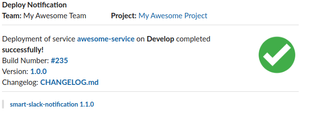
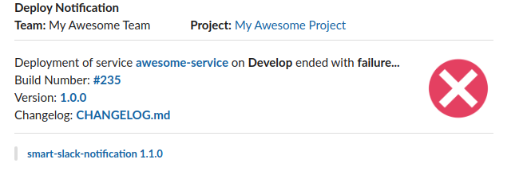

# Bitbucket Pipelines Pipe: Smart Slack Notification Pipe

Notifications to slack for bitbucket pipelines. It's possible send notifications to many webhooks simultaneously.
Observe the complete result below:

### Success Notification Example



### Failure Notification Example



where:

* **Team**: Team name definided in `TEAM_NAME` variable
* **Project**: Project name definided in `PROJECT_NAME` variable. *The project link is definided automatically.*
* **Service**: Service name. *Definided automatically by repository name.*
* **Deployment Environment**: Definided by [bitbucket deployments](https://confluence.atlassian.com/bitbucket/bitbucket-deployments-940695276.html) configuration
* **Build Number**: Link to a Bitbucket Pipeline Build Number.
* **Version**: Tag version. *The project link is definided automatically*
* **CHANGELOG**: Link to the `CHANGELOG` file in your project.

### How does Smart Slack Notification Discover a Deployment With Failure?

Based in bitbucket pipelines [`after-script`](https://confluence.atlassian.com/bitbucket/configure-bitbucket-pipelines-yml-792298910.html?_ga=2.70482000.175567917.1587490062-62368228.1564429862#Configurebitbucket-pipelines.yml-ci_pull-requests) statement. 

`after-script` - Commands inside an after-script section will run when the step succeeds or fails. Then the `BITBUCKET_EXIT_CODE` environment is used to choose between success (`BITBUCKET_EXIT_CODE=0`) or failure (`BITBUCKET_EXIT_CODE=1`) notification.  

## YAML Definition

Add the following snippet to the script section of your `bitbucket-pipelines.yml` file:

```yaml
script:
  - pipe: docker://raphacps/smart-slack-notification-pipe:1.1.0
    variables:
      TEAM_NAME: "<string>"
      PROJECT_NAME: "<string>"
      SLACK_HOOK_URL: "<string>" or "<array>".
      # CHANGELOG: "<boolean>" # Optional - default: "false"
      # VERSION: "<string>" # Optional - default: ""
```

## Usage

#### Complete Version

```yaml
script:
  - pipe: docker://raphacps/smart-slack-notification-pipe:1.1.0
    variables:
      TEAM_NAME: "My Project"
      PROJECT_NAME: "My Awesome Team"
      SLACK_HOOK_URL: "https://hooks.slack.com/services/999999999/999999999/aaaaaaaaaaaaaaaaaaa"
      # SLACK_HOOK_URL: "https://hooks.slack.com/services/999999999/999999999/aaaaaaaaaaaaaaaaaaa,https://hooks.slack.com/services/8888888/88888888/bbbbbbbbbbbbbbbbbbb" # <Array example>
      CHANGELOG: "true"
      VERSION: "1.0.0"
```
#### Multiple Webhook Version

```yaml
script:
  - pipe: docker://raphacps/smart-slack-notification-pipe:1.1.0
    variables:
      TEAM_NAME: "My Project"
      PROJECT_NAME: "My Awesome Team"
      SLACK_HOOK_URL: "https://hooks.slack.com/services/999999999/999999999/aaaaaaaaaaaaaaaaaaa,https://hooks.slack.com/services/8888888/88888888/bbbbbbbbbbbbbbbbbbb" # <Array example>
      CHANGELOG: "true"
      VERSION: "1.0.0"
```
#### Short Version

```yaml
script:
  - pipe: docker://raphacps/smart-slack-notification-pipe:1.1.0
    variables:
      TEAM_NAME: "My Project"
      PROJECT_NAME: "My Awesome Team"
      SLACK_HOOK_URL: "https://hooks.slack.com/services/999999999/999999999/aaaaaaaaaaaaaaaaaaa"
```

## Variables

| Variable              | Description                                                       |
| --------------------- | ----------------------------------------------------------- |
| TEAM_NAME (*)         | The development team name.                            |
| PROJECT_NAME (*)      | The project Name                           |
| SLACK_HOOK_URL (*)    | slack [webhook](https://api.slack.com/messaging/webhooks) |
| VERSION        | tag version |
| CHANGELOG             | Enable or disable the link to the changelog. Default: `"false"`. |

_(*) = required variable._

### Running Locally
To run locally execute the code below:

`docker-compose build && docker-compose up`

## Generating a new version

   To generate a new version, please :
   
   - [x] Test your changes
   - [x] Bump to the new [version](https://semver.org/) in the [changelog](https://keepachangelog.com/en/1.0.0/). 
   - [x] Bump to the new in the [docker-compose.yml](docker-compose.yml) file.
   - [x] Open a Pull Request with a description of your changes

> Docker Repository https://hub.docker.com/repository/docker/raphacps/smart-slack-notification-pipe