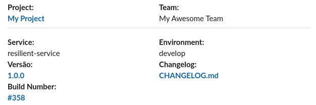

# Bitbucket Pipelines Pipe: Smart Slack Notification Pipe

Notifications to slack for bitbucket pipelines. It's possible send notifications to many webhooks simultaneously.
Observe the complete result below:



where:

* **Project**: Project name definided in `PROJECT_NAME` variable. *The project link is definided automatically.*
* **Team**: Team name definided in `TEAM_NAME` variable
* **Service**: Service name. *Definided automatically by repository name.*
* **Environment**: Definided by branch name according rules below:
    * `master`: "production"
    * `staging` or `stage`: "staging"
    * `other branch names`: "develop"
* **Version**: Tag version. *The project link is definided automatically*
* **CHANGELOG**: Link to the `CHANGELOG` file in your project.
* **Build Number**: Link to a Bitbucket Pipeline Build Number.

## YAML Definition

Add the following snippet to the script section of your `bitbucket-pipelines.yml` file:

```yaml
script:
  - pipe: docker://raphacps/smart-slack-notification-pipe:1.0.0
    variables:
      TEAM_NAME: "<string>"
      PROJECT_NAME: "<string>"
      SLACK_HOOK_URL: "<string>" or "<array>".
      # CHANGELOG: "<boolean>" # Optional - default: "false"
      # VERSION: "<string>" # Optional - default: ""
```

## Usage

#### Complete Version

```yaml
script:
  - pipe: docker://raphacps/smart-slack-notification-pipe:1.0.0
    variables:
      TEAM_NAME: "My Project"
      PROJECT_NAME: "My Awesome Team"
      SLACK_HOOK_URL: "https://hooks.slack.com/services/999999999/999999999/aaaaaaaaaaaaaaaaaaa"
      # SLACK_HOOK_URL: "https://hooks.slack.com/services/999999999/999999999/aaaaaaaaaaaaaaaaaaa,https://hooks.slack.com/services/8888888/88888888/bbbbbbbbbbbbbbbbbbb" # <Array example>
      CHANGELOG: "true"
      VERSION: "1.0.0"
```

#### Short Version

```yaml
script:
  - pipe: docker://raphacps/smart-slack-notification-pipe:1.0.0
    variables:
      TEAM_NAME: "My Project"
      PROJECT_NAME: "My Awesome Team"
      SLACK_HOOK_URL: "https://hooks.slack.com/services/999999999/999999999/aaaaaaaaaaaaaaaaaaa"
```

## Variables

| Variable              | Description                                                       |
| --------------------- | ----------------------------------------------------------- |
| TEAM_NAME (*)         | The development team name.                            |
| PROJECT_NAME (*)      | The project Name                           |
| SLACK_HOOK_URL (*)    | slack [webhook](https://api.slack.com/messaging/webhooks) |
| VERSION        | tag version |
| CHANGELOG             | Enable or disable the link to the changelog. Default: `"false"`. |

_(*) = required variable._

## Running Locally
To run locally execute the code below:

##### Complete Version with one webhook:
```
  docker run \
       -e PROJECT_NAME="My Project" \
       -e TEAM_NAME="My Awesome Team" \
       -e SLACK_HOOK_URL="https://hooks.slack.com/services/999999999/999999999/aaaaaaaaaaaaaaaaaaa" \
       -e VERSION="1.0.0" \
       -e CHANGELOG="true" \
       raphacps/smart-slack-notification-pipe:1.0.0    
```

##### Simultaneous slack webhook Notifications:
```
  docker run \
       -e PROJECT_NAME="My Project" \
       -e TEAM_NAME="My Awesome Team" \
       -e SLACK_HOOK_URL="https://hooks.slack.com/services/999999999/999999999/aaaaaaaaaaaaaaaaaaa,https://hooks.slack.com/services/8888888/88888888/bbbbbbbbbbbbbbbbbbb" \
       -e VERSION="1.0.0" \
       -e CHANGELOG="true" \
       raphacps/smart-slack-notification-pipe:1.0.0    
```

##### Short version:
```
  docker run \
     -e PROJECT_NAME="My Project" \
     -e TEAM_NAME="My Awesome Team" \
     -e SLACK_HOOK_URL="https://hooks.slack.com/services/999999999/999999999/aaaaaaaaaaaaaaaaaaa" \
     raphacps/smart-slack-notification-pipe:1.0.0    
```

## Generating a new version

   To generate a new version, please :
   
   - [x] Test your changes
   - [x] Bump to the new [version](https://semver.org/) in the [changelog](https://keepachangelog.com/en/1.0.0/). 
   - [x] Open a Pull Request with a description of your changes

> Docker Repository https://hub.docker.com/repository/docker/raphacps/smart-slack-notification-pipe